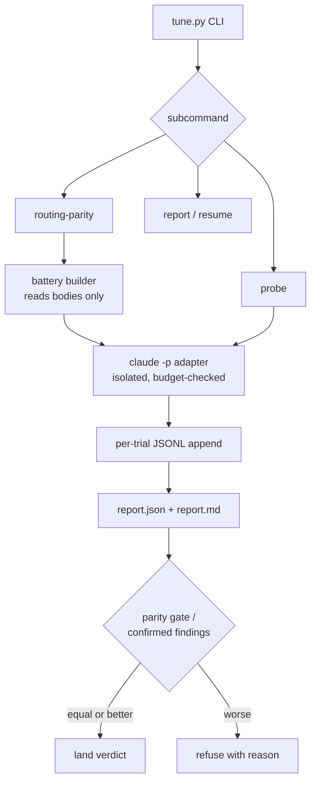

# Skill Tuner - Plan

## Goal Capsule

- **Objective:** Ship `/skill-tuner` — an OSS Claude Code plugin on the hov marketplace that measurably optimizes agent-consumed documents: evidence-tagged authoring doctrine plus a bundled headless eval runner that proves each change on the adopter's own harness.
- **Product authority:** This plan owns the skill-tuner plugin: its repo, doctrine, runner, and marketplace onboarding. The dotfiles-side swap of the vendored writing-for-agents fork and any memory-dream publishing are adjacent work, not active scope.
- **Target repos:** U1–U6 target the new plugin repo (`StartupBros-com/skill-tuner`; paths repo-relative to it). U7 spans `hov-marketplace` and the operator's dotfiles.
- **Stop conditions:** Stop and surface if the swap gate loses (never ship a loser); if marketplace validation cannot pass without changing validator semantics; or if evidence invalidates a session-settled decision.
- **Tail ownership:** Marketplace release steps follow the public-flip runbook; release publication is Will-owned, never automated by this plan's executor.

---

## Product Contract

Product Contract preservation: restructured, no scope change — R7 wording clarified (dependency-free → no third-party dependencies), R8 gained a pre-flight estimate clause, R9's boundary worded as per-turn instruction, R15 and AE4 added from research, F2 gained a post-publish idempotency step, Outstanding Questions resolved into KTD1–KTD6. All changes confirmed via the scoping synthesis.

### Summary

Build `skill-tuner`: a new plugin in its own repo, pinned into the hov marketplace, that pairs authoring doctrine for agent-consumed documents (skills, AGENTS.md, CLAUDE.md) with a bundled eval runner. Every doctrine rule carries an evidence tag and a falsifier; the runner lets any adopter reproduce the receipts on their own skills via headless `claude -p`.

### Problem Frame

Every authoring guide for agent documents ships claims without measurement. The most-starred example (mattpocock's writing-for-agents) argues its rules; Anthropic's skill-creator measures skills but carries no authoring theory; style-compliance tools lint conformance and call it evidence. Adopters cannot tell which rules work, and the guides cannot tell either — their claims aged silently as models changed.

Two days of evaluation in the operator's harness produced the missing half: a routing-parity eval that validated description pruning (30/30 routing at a 37% token cut), a probe protocol that found two adversarially-confirmed defects in a document that had just survived an 11-agent audit, and a drift-retest discipline grounded in a measured change of Claude Code's own defaults. That machinery exists today only as session artifacts and a private evidence ledger. Packaging it is also House of Vibe's entry into visible OSS contribution.

### Key Decisions

- KD1. **Name: `skill-tuner`.** Function-first frame with distinctiveness — tuner culture is measurement culture. (session-settled: user-approved — chosen over `/skill-optimizer`: collides with skill-creator's advertised "optimize a skill's description" verb and matches generic-listicle naming.)
- KD2. **Standalone artifact over upstream contribution.** (session-settled: user-directed — chosen over PRing the eval harness into mattpocock/skills: loses name, control, and marketplace presence, and eval contributions observably rot in that queue.) Governs R1, R3.
- KD3. **Bundled headless runner over a Workflow-tool script.** (session-settled: user-approved — chosen over the session-bound Workflow variant: most adopters are Claude Code CLI subscription users; headless `claude -p` runs on subscription auth and is CI-able.) Governs R7, R8.
- KD4. **Two launch gates only: swap-gate victory and a receipts-first README.** (session-settled: user-directed — chosen over also gating on a stranger-machine run and an upstream courtesy pass: those drop to non-gating.) Governs R12, R13.
- KD5. **Doctrine may model-invoke; the runner never fires on the model's own initiative.** The runner spends the adopter's tokens; every eval run follows a per-turn human instruction. (session-settled: user-approved.) Governs R6, R9.
- KD6. **Evidence tags on every rule are the differentiator.** The SOTA claim is structural, not asserted: each rule self-reports its evidence tier and its falsifier. (session-settled: user-approved.) Governs R4, R5.

### Requirements

**Packaging and marketplace**

- R1. skill-tuner lives in its own GitHub repo under the marketplace owner's org, shaped to pass the marketplace validator at the pinned commit: `.claude-plugin/plugin.json` with matching name and semver version, and `skills/skill-tuner/SKILL.md`.
- R2. Marketplace onboarding edits the validator's approved-source allowlist and adds the pinned `marketplace.json` entry satisfying the validator's checks, enumerated in U7.
- R3. The plugin is MIT with a visible attribution section naming writing-for-agents (MIT) as its ancestor and stating what was extended — the marketplace's first derived-work attribution.

**Doctrine**

- R4. Every doctrine rule carries an evidence tag — `research`, `measured`, or `craft` — and a one-line falsifier stating what result would kill the rule.
- R5. The doctrine incorporates the locally validated rules (time-relative no-op drift retest, priced subagent escape hatch, self-application fixes) and labels unproven inherited claims (leading words) as `craft`, never as fact.
- R6. The doctrine half is model-invocable with a pruned, one-trigger-per-branch description; it fires on creating or editing skills, AGENTS.md, or CLAUDE.md.

**Runner**

- R7. The eval runner ships as scripts with no third-party dependencies under `skills/skill-tuner/scripts/`, orchestrating headless `claude -p` calls; no Workflow tool, no API-only assumptions.
- R8. Runner defaults isolate every eval call with `--setting-sources ""`, pin the model, and report token spend. Before any spend, the runner prints a trial-count and cost estimate. API-key users get a budget cap; unmetered runs are rejected unless explicitly overridden.
- R9. No runner entry point is model-invocable, and the model never initiates a run. The sanctioned path is a per-turn human instruction — including the human telling their agent to run it, which the agent then executes via shell.
- R10. The routing-parity eval implements: prune descriptions per doctrine → build a blind battery from skill bodies (never descriptions) → include distractor skills and near-miss prompts → at least two trials per condition → a parity-gate verdict (land the prune only at equal-or-better routing).
- R11. The marginal-value probe implements: apply the doctrine to the adopter's chosen document → adversarially verify each finding in a fresh context → report only confirmed findings with their evidence.
- R15. Every run writes a durable report — machine-readable results plus a human-readable summary — that a later session or different agent can read by path. Trials persist incrementally, so an interrupted battery resumes instead of re-spending. README receipts derive from these reports.

**Receipts and launch**

- R12. The README leads with reproduced numbers (routing table, token cut, confirmed-defect count) and the exact commands that reproduce them.
- R13. Launch requires the swap gate: skill-tuner replaces the operator's frozen writing-for-agents fork only after winning the same eval pipeline — equal-or-better routing parity and equal-or-more confirmed probe findings. What ships is what the authors themselves switched to.
- R14. Published receipts cite the dotfiles evidence ledger (PR #247) as their source once it lands; until then the numbers are labeled as session-measured.

### Key Flows

- F1. Adopter tunes a skill
  - **Trigger:** Adopter edits a skill description or body with skill-tuner installed.
  - **Steps:** Doctrine fires (model-invoked) and shapes the edit; the adopter instructs a run of the routing-parity eval (directly or via their agent, per R9); the runner prints the cost estimate, runs the battery, and writes the report; the adopter lands or reverts per the gate.
  - **Covers:** R6, R7, R9, R10, R15.
- F2. Launch qualification
  - **Trigger:** skill-tuner v1 candidate is complete.
  - **Steps:** Run the swap-gate pipeline against the incumbent fork in the operator's harness; on victory, trigger the separate dotfiles swap PR, refresh README receipts from the run reports, pin the repo sha into the marketplace with the allowlist edit; verify the publish is idempotent and installs without duplicate skills in user-global directories; on loss, fix or hold.
  - **Covers:** R12, R13, R2.

### Acceptance Examples

- AE1. **Covers R10.** Given a pruned description and a blind battery, when routing accuracy is equal-or-better across two trials, then the prune lands and the report records both conditions' scores.
- AE2. **Covers R10.** Given the same setup, when the pruned condition loses routing accuracy, then the original description stays and the report says why — the gate never lands a regression.
- AE3. **Covers R8.** Given an API-key user invoking the runner with no budget flag, when the run would be unmetered, then the runner refuses with the override named rather than silently spending.
- AE4. **Covers R9.** Given the doctrine fires while an agent edits a skill, when no per-turn human instruction to evaluate exists, then the session never invokes the runner — doctrine text describes the runner, it never directs running it.

### Scope Boundaries

- Skill scaffolding and creation stay skill-creator's job; skill-tuner optimizes and validates existing documents.
- No full eval suite in v1 — routing-parity and the probe protocol only; A/B authoring evals and drift automation are v2 candidates.
- No Workflow-tool runner variant; no parallel trial execution in v1.
- No upstream PR of the harness; filing defect findings upstream stays available post-launch as goodwill, not a gate.
- memory-dream marketplace publishing is a separate future effort.
- Full pause/resume job lifecycle and machine-readable land/revert schema for programmatic gate consumption: deferred until an adopter needs them (crash-resume per R15 is in scope).

### Dependencies / Assumptions

- dotfiles PR #247 must merge before README receipts switch from "session-measured" labels to ledger citations (R14). It does not block implementation.
- Portability is asserted, not proven: the stranger-machine gate was dropped, so the works-anywhere claim rests on isolation flags plus the subscription-auth assumption until someone else runs it.
- Maintenance is personal dogfooding; public README numbers may age between refreshes after model releases.
- hov-marketplace CI runs full pinned-source validation unconditionally (`HOV_SOURCES_PUBLIC` true since 2026-07-14), so the skill-tuner repo must be public with a tagged release at the pinned sha before the U7 marketplace PR opens; release publication stays Will-owned per the runbook.

### Sources / Research

- Marketplace mechanics: `scripts/validate-marketplace.sh` in hov-marketplace — allowlist case statement, manifest-entry shape (six checks: name regex, approved `.git` URL, 40-hex lowercase sha, semver version, uint releaseId, releaseTag = `v`+version), pinned-commit content checks, monotonicity rules. New plugin rows need no first-add exemption.
- Packaging conventions: pro-gate's plugin tree (plugin.json fields, `VERSION` file, doctor-script pattern, runtime version precheck via `CLAUDE_PLUGIN_ROOT`).
- Runner architecture precedent: the i-have-adhd `evals/` harness — subcommand CLI, resumability key `(case, trial, condition, runner)`, budget parsing from `claude --output-format json` `total_cost_usd`, unmetered rejection before any call, retries with backoff, append-only JSONL, isolation flag set, and its postmortem fixes (cwd pinning, baseline-leak warning, judge-blinding gap).
- Evidence base: StartupBros-com/dotfiles PR #203 (vendored fork + validation results) and PR #247 (evidence ledger + validated prunes, open draft).
- Ancestor: github.com/mattpocock/skills `skills/productivity/writing-for-agents` (MIT).

---

## Planning Contract

### Key Technical Decisions

- KTD1. **Runner language: Python 3 standard library only.** (session-settled: user-approved — chosen over a pure-bash reimplementation: stdlib Python matches the operator's stdlib-CLI convention, reuses the proven resume/budget design from the precedent harness, and stays inside R7's no-third-party-dependency bound.) Cites R7.
- KTD2. **In-prompt presentation for every eval call.** Eval sessions receive skill descriptions (routing) or doctrine text plus target doc (probe) inside the prompt of an isolated headless call; nothing is installed into the eval session's settings. (session-settled: user-approved — chosen over installing skills into a stripped settings dir: no precedent solves "isolate everything except the skill under test," and in-prompt is the design the validated session eval used.) Blinding becomes enforceable in code: the battery builder's input excludes description fields by construction. Cites R10, R11.
- KTD3. **Durable report contract with incremental persistence.** Each run writes `reports/<run-id>/report.json` (machine-readable) and `report.md` (human summary); trials append to a JSONL log as they complete; a rerun skips completed `(case, trial, condition)` rows; the pre-flight estimate prints before the first call. (session-settled: user-approved.) Cites R8, R15.
- KTD4. **Runner boundary instantiation.** The CLI runs only via explicit per-turn instruction. Doctrine text mentions the runner descriptively and never imperatively, so a doctrine-firing session cannot read an instruction to run it. A regression check greps the doctrine for imperative runner phrasing. Inherits KD5's settlement; cites R9, AE4.
- KTD5. **Mirror pro-gate packaging.** plugin.json field set (author "StartupBros / House of Vibe", homepage, bare `repository`, keywords including `house-of-vibe`), root `VERSION` file, and an optional `doctor.sh` preflight following pro-gate's ok/warn/blocking check pattern. Marketplace conformance is the validator's five checks, not a design space. Cites R1, R2.
- KTD6. **Battery defaults grounded in the measured run.** Per target skill: two obvious prompts and one paraphrase, plus a shared pool of near-miss and none-of-the-above prompts; at least five distractor skills; two trials per condition minimum. These are the sizes at which the validated run produced legible signal (30/30 vs 28/30 at n=30/condition). Cites R10.

### Assumptions

- `python3` is present on adopter machines (doctor checks and reports if absent).
- The `claude` CLI supports `-p`, `--output-format json`, and `--setting-sources` (verified against v2.1.221 this week; doctor re-checks at runtime).
- Prompt templates for router and probe calls are tuned during implementation; their exact wording is not a plan-level contract.

### High-Level Technical Design

The adapter is the single chokepoint: isolation flags, model pin, budget check, cost parsing, and retries live there, so no eval path can reach the CLI unguarded.

---

## Implementation Units

### U1. Scaffold the plugin repo

- **Goal:** A repo shaped to pass the marketplace validator at any pinned commit.
- **Requirements:** R1, R3.
- **Dependencies:** None.
- **Files:** `.claude-plugin/plugin.json`, `VERSION`, `LICENSE`, `README.md` (skeleton with attribution section), `.gitignore`, `skills/skill-tuner/SKILL.md` (placeholder replaced in U2).
- **Approach:** Follow KTD5's field set. Attribution section names writing-for-agents (MIT) as ancestor per R3.
- **Patterns to follow:** pro-gate's `.claude-plugin/plugin.json` and `VERSION` conventions.
- **Test scenarios:** Test expectation: none — scaffolding; shape is verified by U7's validator run.
- **Verification:** `plugin.json` parses, name/version match `VERSION`, `skills/skill-tuner/SKILL.md` exists.

### U2. Write the doctrine

- **Goal:** The evidence-tagged doctrine SKILL.md — the model-invoked half of the plugin.
- **Requirements:** R4, R5, R6; KTD4 constrains phrasing.
- **Dependencies:** U1.
- **Files:** `skills/skill-tuner/SKILL.md`.
- **Approach:** Seed from the operator's vendored writing-for-agents fork plus the HARNESS-NOTES evidence ledger, by the recorded vendoring convention: evidence-tag each rule (`research` / `measured` / `craft`) with a falsifier, cite dotfiles PR #247 as source, never inline-copy ledger prose. Description follows one-trigger-per-branch (per R6). Runner is described, never directed (per KTD4).
- **Patterns to follow:** dotfiles `claude/skills-local/writing-for-agents/` (fork + UPSTREAM.md + HARNESS-NOTES.md).
- **Test scenarios:**
  - Covers AE4. Grep check: SKILL.md contains no imperative runner-invocation phrasing.
  - Dogfood: skill-tuner's own description routes correctly in a battery that includes it among distractors (run in U6).
- **Verification:** Every rule carries a tag and falsifier; description parses; frontmatter has no `disable-model-invocation` key.

### U3. Runner core

- **Goal:** The CLI skeleton, the guarded adapter, and the report/resume machinery every eval shares.
- **Requirements:** R7, R8, R9, R15; KTD1, KTD2, KTD3, KTD4.
- **Dependencies:** U1.
- **Files:** `skills/skill-tuner/scripts/tune.py`, `skills/skill-tuner/scripts/tests/test_runner_core.py`.
- **Approach:**
  1. Subcommand CLI (`routing-parity`, `probe`, `report`) matching the design diagram, with a single adapter function owning isolation flags, model pin, budget check, `total_cost_usd` parsing, and bounded retries; resume is a flag on the eval subcommands, and doctor stays the standalone `doctor.sh` (U6), never a tune.py subcommand.
  2. Unmetered rejection before any subprocess call unless overridden; budget cap halts mid-run.
  3. Pre-flight estimate (trial count × observed-or-default cost) printed before the first call.
  4. Append-only JSONL trial log; resume skips completed rows; report writer emits `report.json` + `report.md` per KTD3.
- **Execution note:** Test-first. Harness bugs invalidate published receipts — the precedent's own postmortem found four.
- **Patterns to follow:** i-have-adhd `scripts/run_evals.py` and `tests/test_run_evals.py` (resume keys, budget enforcement, retry shape, fake-runner discipline).
- **Test scenarios:** (fake adapter, no live calls)
  - Covers AE3. Unmetered runner rejected before any call — a marker file proves no subprocess ran.
  - Budget cap reached mid-battery halts cleanly; completed trials persist.
  - Rerun after simulated crash skips completed rows and finishes the remainder.
  - Report writer emits both files; JSON parses; summary names both conditions.
  - Pre-flight estimate prints before the first adapter call.
  - Covers AE4. The plugin manifest and skill frontmatter register no command, tool, or invocable entry pointing at `tune.py` — the runner is reachable only by explicit shell invocation.
- **Verification:** Unit tests green via `python3 -m unittest` from the scripts dir; manifest check green.

### U4. Routing-parity eval

- **Goal:** The prune-validation eval with its blind battery and parity gate.
- **Requirements:** R10, AE1, AE2; KTD2, KTD6.
- **Dependencies:** U3.
- **Files:** `skills/skill-tuner/scripts/routing_parity.py`, `skills/skill-tuner/scripts/tests/test_routing_parity.py`.
- **Approach:** Battery builder consumes skill bodies only — the code path that reads target skills strips description fields before the builder sees them, making blinding structural. Router calls present the description set in-prompt per KTD2. Pairing check requires identical case-and-trial rows across conditions before scoring. Gate verdict per the parity rule owned by R10.
- **Patterns to follow:** The precedent's `_check_pairing` shape; the session eval's battery design (KTD6 sizes).
- **Test scenarios:** (fake adapter)
  - Covers AE1. Equal-or-better routing across two trials → land verdict with both scores recorded.
  - Covers AE2. Worse routing → refuse verdict with the failing prompts named.
  - Blinding enforcement: description text reaching the battery builder raises a hard error.
  - Pairing mismatch (a condition missing a trial row) raises instead of scoring.
  - Prompt-order rotation differs between trials.
- **Verification:** Unit tests green; a dry-run against fixture skills produces a well-formed report.

### U5. Marginal-value probe

- **Goal:** The doctrine-application probe with fresh-context adversarial verification.
- **Requirements:** R11; KTD2.
- **Dependencies:** U3.
- **Files:** `skills/skill-tuner/scripts/probe.py`, `skills/skill-tuner/scripts/tests/test_probe.py`.
- **Approach:** Probe call presents doctrine plus target document in-prompt; findings parse to structured entries; each finding dispatches one fresh isolated verify call with a default-refute skeptic prompt; the report carries confirmed findings only, with quoted evidence.
- **Test scenarios:** (fake adapter)
  - Each finding's verifier runs in a fresh session — no shared context between verify calls.
  - Refuted findings are excluded from the report; the count of refuted is still recorded.
  - Zero findings is a valid, well-formed result (the probe must not manufacture defects).
- **Verification:** Unit tests green.

### U6. Receipts, README, and doctor

- **Goal:** The receipts-first README backed by real runs, plus the environment preflight.
- **Requirements:** R12, R14, R3; KD4's receipts gate.
- **Dependencies:** U2, U4, U5.
- **Files:** `README.md`, `skills/skill-tuner/scripts/doctor.sh`, `reports/` (committed receipts runs).
- **Approach:** Run routing-parity on two to three real skills and the probe on one real document; README leads with the results table, token deltas, and the exact reproduce commands; numbers labeled session-measured until dotfiles PR #247 merges (per R14). `doctor.sh` prechecks `claude` presence, flag support, and `python3`, in pro-gate's ok/warn/blocking style.
- **Test scenarios:**
  - Doctor exits non-zero when `claude` is absent from PATH (manipulated-PATH test).
  - README reproduce commands match the CLI's actual flags (checked against `--help` output).
  - Covers the U2 dogfood scenario: skill-tuner's own description in the battery.
- **Verification:** README's leading table is generated from a committed report file, not hand-typed.

### U7. Swap gate and marketplace onboarding

- **Goal:** Launch qualification: beat the incumbent, then pin into the marketplace.
- **Requirements:** R13, R2, F2; R1 verified here.
- **Dependencies:** U6.
- **Files:** (hov-marketplace) `scripts/validate-marketplace.sh`, `.claude-plugin/marketplace.json`; (dotfiles) the writing-for-agents fork swap — adjacent work, PR'd separately.
- **Approach:**
  1. Run the swap-gate pipeline against the incumbent fork in the operator's harness; record verdict in a committed report (per R13 — hold on loss).
  2. On victory: add the allowlist case line for `skill-tuner`, add the pinned `marketplace.json` entry satisfying the validator's six checks (name regex, approved URL with `.git`, 40-hex lowercase sha, semver version, uint releaseId, releaseTag `v`+version).
  3. Verify post-publish idempotency per F2: a rerun creates no second marketplace commit; install smoke shows no duplicate skill in user-global directories.
  4. Sequencing: full pinned-source validation runs on the marketplace PR itself (`HOV_SOURCES_PUBLIC` has been true since 2026-07-14), so the skill-tuner repo must be public with a resolvable `v<version>` release tag at the winning sha — a Will-owned publication step — before the PR opens.
- **Test scenarios:**
  - `validate-marketplace.sh syntax` passes with the new entry.
  - Monotonicity check passes for a brand-new row.
  - The pinned sha contains `.claude-plugin/plugin.json` (matching name/version) and `skills/skill-tuner/SKILL.md`.
- **Verification:** Validator green in syntax mode locally and in full mode on the marketplace PR; swap-gate report committed; release-publication steps acknowledged as Will-owned.

---

## Verification Contract

| Gate | Command / check | Proves |
|---|---|---|
| Runner unit tests | `python3 -m unittest discover skills/skill-tuner/scripts/tests` | U3–U5 logic: budget, resume, blinding, gate arithmetic, verifier independence |
| Doctrine phrasing | grep for imperative runner phrasing in `skills/skill-tuner/SKILL.md` | AE4 / KTD4 boundary |
| Environment preflight | `skills/skill-tuner/scripts/doctor.sh` | Adopter machine readiness |
| Receipts integrity | README table matches committed `reports/` files | R12 — receipts are generated, not asserted |
| Marketplace conformance | `scripts/validate-marketplace.sh syntax` (hov-marketplace) | R1, R2 shape |
| Swap gate | Pipeline run vs incumbent fork, committed report | R13 launch gate |

---

## Definition of Done

- All unit tests green; no live-call test in the suite (fake adapter only).
- Doctrine SKILL.md complete: every rule tagged and falsifiable; AE4 grep clean.
- Receipts run committed under `reports/`; README leads with its numbers and reproduce commands, labeled per R14's current state.
- Swap gate won and recorded; the harness switch handed off to the adjacent dotfiles PR.
- Marketplace entry passes syntax validation; allowlist edited; release steps handed to the Will-owned runbook.
- No abandoned experimental code in the final diff.
