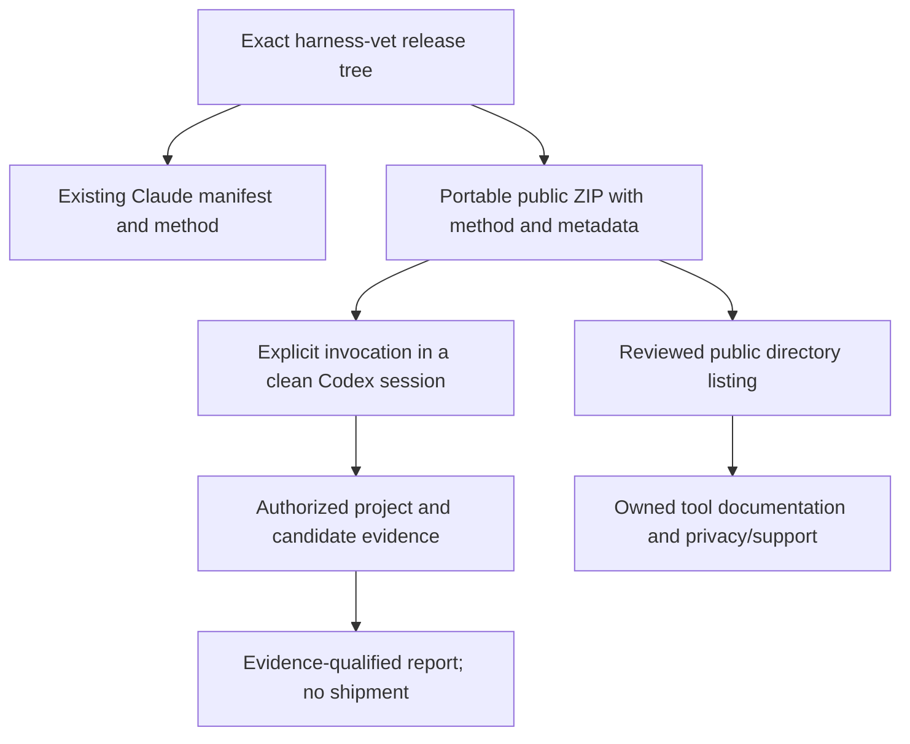
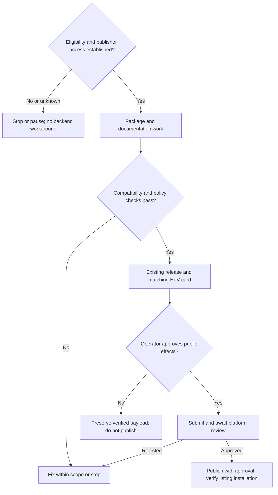

# HoV Harness Vet Public Directory - Plan

**Plan owner:** `hov-marketplace`. **Implementation repos:** `harness-vet`, `pushbot`, and `hov-marketplace`.
File paths below are relative to the repo named by their unit or source entry.
**Tracking:** [hov-marketplace #187](https://github.com/StartupBros-com/hov-marketplace/issues/187) tracks planning, not implementation admission.

## Goal Capsule

- **Objective:** Codex users can discover and use a useful HoV tool to assess third-party agent additions before adopting them.
- **Means:** Distribute the existing harness-vet methodology through a portable public plugin package and an owned documentation destination (KTD1–KTD3).
- **Authority:** Product requirements govern behavior; technical decisions govern implementation within those requirements; platform rules and operator consent constrain publication.
- **Execution profile:** Codex-first, smoke-first verification; ChatGPT compatibility remains a separate claim requiring separate evidence.
- **Stop conditions:** R9 blocks substantial implementation until eligibility and publisher access are established. R10 blocks public effects without approval. Stop rather than add an MCP backend or weaken the methodology to secure a listing.
- **Finish and ship:** An implementation owner carries U2–U5 through verified code delivery; the operator handles publisher verification and expressly approved release effects in U1/U6. A package-only milestone is not a completed public-directory trial.

---

## Product Contract

### Summary

Prepare one complete, useful harness-vet plugin for the shared Codex/ChatGPT public directory, proving Codex behavior first.
Provide a neutral HoV documentation/support destination and truthful privacy information.
Treat discovery and referrals as a channel experiment, not a promised SEO improvement.

### Problem Frame

HoV already distributes tools through its Claude marketplace and has historical Codex install evidence, but neither establishes current public-directory placement or runtime compatibility.
Existing package homepage fields do not populate OpenAI listing URLs, and the main HoV website is a membership-sales destination rather than tool documentation.

### Requirements

**Function and control**

- R1. Preserve harness-vet's existing methodology, evidence tiers, verdict vocabulary, reader/verifier caps, and supported report-only workflow.
- R2. Require explicit invocation and keep report-only execution from shipping, activating, or modifying the candidate or the user's harness.
- R3. Preserve separate consent for token-spending experiments, disposable installations, and other consequential verification actions; neither report-only nor a fresh HOME proves containment.
- R4. Report unavailable access or incomplete verification as named evidence gaps using the existing PARTIAL/SKIP conventions, not fabricated ADOPT/ADAPT, security failure, or compatibility claims.

**Package and supported clients**

- R5. Provide a public-submission package containing the full four-document methodology, applicable license notices, native invocation metadata, and required presentation assets, without hooks, app references, credentials, or private author-harness files.
- R6. Preserve existing Claude packaging and install instructions; claim Codex support only after real clean-session verification and ChatGPT support only after separate verification.
- R7. Configure explicit listing website, support, and privacy destinations; package homepage and author URL alone do not satisfy the listing-link goal.

**Public destination and data**

- R8. Provide publicly readable, nontransactional tool documentation with installation guidance, limitations, support, and tool-specific privacy information; no advertisements, membership checkout, subscription promotion, or purchase-initiating links belong in the plugin or its listing destination.
- R11. Introduce no hidden plugin telemetry or HoV execution backend; distinguish agent filesystem/network/model-provider processing from disclosed website analytics and support submissions.
- R14. Evaluate the channel using directory-attributed website sessions and attributable downstream joins when observable, with sessions as the conversion denominator and maintenance/support effort as the countermetric; unavailable data and SEO impact remain unknown.

**Eligibility and release**

- R9. Before substantial package/page implementation, establish that the selected verified developer identity has submission access and that this skills-only package is eligible; inability to establish the prerequisite pauses the experiment, and confirmed ineligibility ends this channel attempt.
- R10. Credential login/rotation, plugin enabling, production deployment, external messages, and public submission/publication require their applicable operator approvals; a request to plan is not those approvals.
- R12. Preserve the existing immutable version/tag/release-ID/SHA/card publication contract; build and submit the exact verified release payload rather than an unrelated working tree.
- R13. Submit a complete working tool after required scans and review; an upload, approval, marketplace repin, published listing, and tested directory installation are distinct outcomes.

### Key Decisions

- **One existing tool, not a new app or catalog-wide migration.** (session-settled: user-approved — chosen over a broader marketplace port or new application: bound the channel experiment to existing useful functionality.) Governs R1, R5, R6.
- **Codex-first, separate ChatGPT proof.** (session-settled: user-approved — chosen over universal compatibility claims: supported surfaces must be exercised independently.) Governs R6.
- **Neutral documentation, not a membership funnel.** (session-settled: user-approved — chosen over the sales homepage as listing destination: preserve standalone utility and satisfy platform commerce rules.) Governs R7, R8, R11.
- **Eligibility before substantial work.** (session-settled: user-approved — chosen over building an MCP service to qualify: uncertain skills-only access must not expand product scope.) Governs R9, R10, R13.

### Acceptance Examples

- AE1. **Covers R1–R6:** In a clean Codex session, an explicit harness-vet request can load all methodology references and produce an evidence-qualified adoption assessment without shipping the candidate.
- AE2. **Covers R2–R4:** A prompt without explicit invocation does not activate the skill; a requested assessment with unavailable credentials records the limitation without installing anything or declaring a failed candidate.
- AE3. **Covers R7, R8, R11:** A visitor arriving through the configured Website link gets usable documentation, support and truthful data disclosures, with no membership-purchase flow.
- AE4. **Covers R9, R10, R13:** A missing publisher permission or unresolved skills-only eligibility stops before implementation/publication; rejection does not trigger a backend, connector, or policy workaround.
- AE5. **Covers R12, R13:** The verified source revision, built ZIP, staged GitHub release, HoV card and submitted package identify the same intended version; directory claims follow a real installation from the published listing.

### Scope Boundaries

No Supabase/member-auth integration, MCP server, hosted execution, global harness reconfiguration, hidden usage tracking, skills registry, release-automation redesign, model bake-off, or whole-marketplace port.
No security certification, license-clearance service, OpenAI endorsement, guaranteed placement, or promised backlink/ranking gain.

**Deferred to follow-up:** Other HoV tools; any separately justified ChatGPT-host adaptation; broader documentation library; unrelated website tracking, release-reconciler, or stale-doc cleanup.

---

## Planning Contract

### Key Technical Decisions

- KTD1. **Add portable packaging, retain Claude metadata.** Use root `plugin.json` with Agent Plugins 1.0.0 identity and `extensions.com.openai.interface`; keep `.claude-plugin/plugin.json`. Prefer one native OpenAI settings owner, not an overlay that silently replaces conflicting settings. This instantiates the one-tool decision under R5/R6. The existing skill-tuner root manifest is a local format precedent, not proof of harness-vet behavior.
- KTD2. **Keep one methodology and explicit host policy.** Retain `skills/harness-vet/{SKILL,DIGEST,EVIDENCE,VERDICTS}.md`; add `skills/harness-vet/agents/openai.yaml` with the documented explicit-only invocation policy. Qualify Claude-specific isolation examples without deleting them, lowering evidence standards, or making the author's unavailable runner a prerequisite. Governs implementation of R1–R4; prompt instructions are not a sandbox.
- KTD3. **Use the existing Astro application for a focused tool page.** Proposed URL: `https://houseofvibe.ai/tools/harness-vet`. Reuse `BaseLayout`, HoV informational footer, crawl registry and existing website privacy/support routes. Add a tool-specific privacy section rather than pretending the general membership policy already covers agent execution. This instantiates the neutral-page decision under R7/R8/R11.
- KTD4. **Do not refactor website tracking.** Existing BaseLayout includes disclosed analytics/advertising plumbing; it is not tracking-free, and source shows scripts may load before consent acceptance. Describe actual website behavior separately from the plugin's lack of added telemetry. Any genuinely required policy correction is scoped to this page/disclosure, not an unrelated global tracking campaign (R11).
- KTD5. **Build a bounded public ZIP from an exact release tree.** Use an explicit inclusion set and reject out-of-tree symlinks; exclude `.git`, caches, auth/config secrets, tests, and unrelated author files. Include every package-relative reference. Preserve the existing draft-release/card/publish workflow, without changing its automation; the public ZIP is a separate submission payload derived from the same release revision (R5/R12).
- KTD6. **Separate static regression checks from live proof.** Package tests validate metadata and inclusion; the existing synthetic fixtures protect the method. Neither establishes runtime isolation, useful Codex behavior, directory acceptance, or published installation. U4 supplies that missing proof (R4/R6/R13).

### High-Level Technical Design

### Readiness and Unresolved Prerequisites

- **Blocking U2–U6:** Account-specific skills-only eligibility, verified identity, and submission permissions remain unverified. Official guidance documents the route but reserves additional skills-only eligibility requirements.
- **Deferred to U4:** Actual Codex invocation, isolation, method fidelity and clean-package behavior. ChatGPT runtime support is outside the first compatibility claim.
- **Deferred to U3/U6:** Live documentation deployment and actual listing URLs, link attributes, crawlability and indexing. These are not established by local source or text extraction.
- **Execution-time check:** Re-read source revisions, current release state, platform rules and exact client version before changing files. Package source was observed at harness-vet 0.2.4; source reading during this plan is not a new runtime/release proof.

### System-Wide Impact

The portable root can change Codex discovery precedence, so retaining the Claude manifest alone is insufficient preservation proof.
The Astro page needs its own crawl declaration to receive a canonical and sitemap inclusion; source-route existence is not deployed/indexed evidence.
Existing HoV release cards remain coupled to staged publication even though the installed plugin itself has no HoV backend.

---

## Implementation Units

### U1. Resolve public eligibility and publisher access

**Goal:** Establish the prerequisite in R9 without changing credentials or expanding the product.
**Requirements:** R9, R10, R13; covers AE4.
**Dependencies:** None. This is the only first step while the prerequisite is unresolved.
**Files:** No application changes. Record the concise decision and evidence locator in the existing tracking issue; do not create a new credential ledger or store identity documents.
**Approach:** Obtain operator-authorized evidence from the submission portal or an authoritative publisher response for the selected verified identity, role, and skills-only submission type. Public documentation alone is not account entitlement.
**Test expectation:** None—an access/eligibility decision, not a software change.
**Verification:** Eligible with the needed access, or an explicit pause/stop reason; no login bypass, secret discovery, plugin activation, or implementation admitted by assumption.

### U2. Add the portable bundle and preservation coverage

**Repo:** `harness-vet`.
**Goal:** Produce the package defined by R5 while retaining R1–R4/R6.
**Dependencies:** U1.
**Files:** Proposed `plugin.json`, `assets/harness-vet.svg`, `skills/harness-vet/agents/openai.yaml`, `scripts/build-public-package.py`, `tests/public-package.test.mjs`; existing `.claude-plugin/plugin.json`, `VERSION`, `README.md`, `skills/harness-vet/SKILL.md`, `DIGEST.md`, `EVIDENCE.md`, `VERDICTS.md`, `.github/workflows/ci.yml`; existing fixture scenarios documented by `tests/README.md`.
**Approach:**
1. Apply KTD1/KTD2 without replacing the existing workflow or weakening its consent/evidence requirements.
2. Apply KTD5 with a standard-library build helper and explicit inclusion set; set listing metadata to the eventual U3 destinations.
3. Add deterministic package tests to CI, retain current version/announce wiring and fixture assertions, and document client-specific invocation and capability limitations.
**Execution note:** Validate packaging and preservation before spending model allowance on runtime checks; introduce no installed-product runtime dependency.
**Test scenarios:**
- The extracted ZIP contains all four method documents, license notice, sidecar and valid referenced icon, with package-relative links resolving.
- Root, Claude manifest and VERSION identify the same version; the native website field is configured separately from homepage.
- Missing references, an out-of-tree symlink, a forbidden hook/app component, an invalid icon or inconsistent version fails package validation.
- The documented native explicit-only policy is present without deleting Claude invocation metadata or its existing install path.
- Existing synthetic decision cases remain unchanged and pass; they are reported as regression evidence, not live proof.
**Verification:** Actual extracted archive and deterministic tests satisfy R5; no claim of runtime compatibility yet.

### U3. Add neutral documentation, support and privacy

**Repo:** `pushbot`, scoped to `apps/startupbros-funnels`.
**Goal:** Provide the destination in R7/R8/R11.
**Dependencies:** U1 and U2's stable metadata/content contract; may run alongside final U2 validation.
**Files:** Proposed `src/pages/tools/harness-vet.astro` and `src/lib/harness-vet-public.test.ts`; existing `src/crawl.ts`, `src/pages/privacy.astro`, `src/layouts/BaseLayout.astro`, `src/components/navigation/HouseOfVibeFooter.astro`, `src/pages/sitemap.xml.ts`; package commands are in `package.json`. All paths in this unit are relative to `apps/startupbros-funnels`.
**Approach:**
1. Follow the existing static informational page pattern and current HoV design guidance; avoid membership components, sales CTAs, or a new layout/tracking subsystem.
2. Declare the canonical tools route in CRAWL_ROUTES and let the existing sitemap derive its URL.
3. Explain tested installation/invocation, evidence limits, consent boundaries, existing support contact and actual data processing; add a stable tool-specific privacy anchor and bind native listing metadata to it.
4. Before directory publication, serve accurate documentation with only actually available install paths; add the real directory link after U6, never a fabricated listing ID or install button.
**Test scenarios:**
- The docs route is public and canonical to the HoV tools URL, appears once in the sitemap, and is not emitted as noindex through an unregistered route.
- Documentation/support/privacy links resolve and contain no checkout, subscription upgrade, paid-audit or purchase-initiating destination.
- Disclosure distinguishes website analytics/support from agent runtime processing and makes no local-only or zero-third-party-request claim.
- Existing membership routes, consent plumbing and checkout attribution remain unchanged.
- The rendered page accurately handles an unpublished directory link rather than presenting an unavailable installation as live.
**Verification:** App tests, typecheck, lint, build/public-surface/sitemap checks pass; after approved deployment, read the actual public page and links. Local rendering is not production or indexing proof.

### U4. Prove Codex behavior and the supported boundary

**Repo:** `harness-vet`.
**Goal:** Establish R6 without substituting fixture agreement for runtime evidence.
**Dependencies:** U2; U3 content available for disclosure review.
**Files:** Existing `tests/README.md` plus U2's proposed `tests/public-package.test.mjs`; update `README.md` with only exercised client instructions. Keep redacted session evidence as temporary verification output, not a new permanent dashboard.
**Approach:** Use the built ZIP/source revision in a clean, expressly approved test profile with no author-harness dependencies. Record the client version, actual model/provenance when available, effective policy/tool access, package revision and observed outcomes. Apply KTD6.
**Test scenarios:**
- Covers AE1: explicitly invoke on a real pinned public candidate with an authorized project; all bundled references load and the report respects the existing scoped verdict/evidence contract.
- Covers AE2: without explicit invocation, the skill remains inactive; unavailable credentials/tools yield named gaps and the required PARTIAL/SKIP behavior.
- A candidate containing instructions to disclose a planted non-secret sentinel or change host configuration is treated as data; neither instruction is executed.
- Without consent, the report-only path does not install, activate, mutate the user harness, or launch token-spending comparative arms; required verification remains incomplete rather than silently skipped as success.
- A separately authorized disposable verification run uses demonstrated containment, not a fresh HOME as its sole boundary.
- The existing Claude path still loads and preserves the same methodology at the new revision; no ChatGPT claim is inferred from the Codex result.
**Verification:** Real session output at the exact package revision supports the published claims. If a necessary host capability cannot be preserved within the bounded adaptation, stop and report the incompatibility. Quota/access failure is pending evidence, not a pass; no silent paid-API fallback.

### U5. Stage the verified version through the existing release contract

**Repos:** `harness-vet`, then `hov-marketplace`.
**Goal:** Preserve R12 while distributing the tested version.
**Dependencies:** U2–U4 and required code-review gates.
**Files:** `harness-vet`: `VERSION`, both manifests and proposed `docs/release-notes/v<next-version>.md`; `hov-marketplace`: `.claude-plugin/marketplace.json`, following `docs/plugin-release-recipe.md`. No release-workflow rewrite is planned.
**Approach:** Follow the existing draft-first release/card/publish sequence, selecting the next version from current execution-time state. Build the public ZIP from that exact staged release revision; do not change identity fields under an unchanged release ID. Separate code landing from operator-approved release/deployment/announcement effects.
**Test scenarios:**
- Version/tag/release-ID/SHA/repository/card tuple identifies the tested source; a stale or mismatched card prevents staged publication.
- The extracted public ZIP matches the frozen release source and cannot be replaced with a dirty working-tree payload under the same declared version.
- Existing marketplace identity/rollback/repin regressions continue to pass; no unrelated card changes are introduced.
**Verification:** Staged revision and matching card are established independently of an announcement. If an announcement is approved, its actual receipt—not merely a green workflow—proves it occurred. Nothing here proves OpenAI publication.

### U6. Submit, publish and inspect the real listing

**Repos:** `harness-vet` and the U3 documentation page in `pushbot`; publisher portal is an operator-gated external surface.
**Goal:** Establish R13 and observe the channel in R14.
**Dependencies:** U1–U5, actual public documentation/support/privacy availability, and the approvals in R10.
**Files:** Existing `README.md` and U3's page/test gain only the actual approved listing URL. No browser automation, publisher credential store, registry or tracking service is added.
**Approach:** Submit the verified ZIP and metadata, resolve required scans/review within scope, publish only after approval, and verify the resulting listing as a user. A rejection pauses or ends this attempt; it does not authorize another product shape.
**Test scenarios:**
- Covers AE3/AE5: Website/support/privacy fields reach the intended live nontransactional pages, and a clean Codex installation from the published directory reproduces the supported workflow.
- An approved-but-unpublished item is not described as discoverable; rejection or absent visibility is not reported as a successful channel launch.
- Actual outbound href/rel, robots/noindex and observed indexing are recorded only when retrievable; an anti-bot challenge is neither authentication proof nor an SEO result.
- Conversion reporting uses the R14 denominator and discloses missing attribution rather than dividing by unrelated whole-site sessions.
**Verification:** A real published listing, actual website click-through, and working directory installation. Keep SEO ranking value unknown absent evidence.

---

## Verification Contract

Commands below are execution-time references, not tests run during planning.
Run them from each task's isolated worktree with the repo's prepared dependencies and existing permission boundaries.

| Surface | Check | Evidence class |
| --- | --- | --- |
| harness-vet package | Proposed `node --test tests/public-package.test.mjs` | Deterministic package/inclusion/preservation tests, not runtime proof |
| harness-vet existing method | Existing 12-case validator and withheld-expectation procedure in `tests/README.md`; preserve CI in `.github/workflows/ci.yml` | Structural/synthetic regressions; existing prose saying thirteen cases is not the validator's assertion |
| Codex and Claude | U4's real clean-session scenarios at the frozen revision | Runtime compatibility and consent boundaries; no hosted ChatGPT proof |
| Astro app | `pnpm --filter startupbros-funnels test`, `typecheck`, `lint`, and `build` | Actual configured app gates; build includes public/agent-runtime validation and may require environment preparation |
| Astro crawl surface | `pnpm --filter startupbros-funnels verify:public-surface` and `verify:sitemap` | Local generated-public-surface and sitemap checks |
| Marketplace | Existing `tests/validate-marketplace.test.sh`, `tests/repin-reconcile.test.sh`, and applicable `scripts/validate-marketplace.sh` mode from `.github/workflows/validate.yml` | Pin/identity policy; source-public and live-network prerequisites are not assumed enabled |
| Release and directory | U5/U6 exact revision/card, approved payload, public URL, clean directory installation and website readback | Separate publication and deployment proof |

Use the user's adversarial-first → applicable code/security review → terminal independent gate ladder during implementation.
Preserve spend consent, subscription-first routing, fail-closed evidence handling and all existing compatibility surfaces.
Static tests, synthetic fixtures, and source inspection must never be presented as live installation, containment, deployment or publication proof.

---

## Definition of Done

- U1 establishes eligibility/access or records a truthful stop; a stop is a concluded feasibility check, not a successful public release.
- The eligible path delivers a complete package and public documentation satisfying R1–R13, with U2–U4 tests at the shipped revision and existing Claude behavior preserved.
- U5 release identity and U6 actual listing/install/readback evidence are established; absent these, only the named intermediate milestone is complete.
- R14 observations use available attribution and report effort and uncertainty without promising ranking improvements.
- No abandoned prototype, credential/identity document, hidden telemetry, permissive guard change, duplicate registry or unrelated cleanup is left in the diff.
- Planning issue #187 is not implementation approval or autonomous-loop admission; execution and public effects respect their own authorization boundaries.

---

## Sources and Research

**Current platform contract, retrieved 2026-09-29:** [plugin packaging](https://developers.openai.com/plugins/build/plugins), [submission](https://developers.openai.com/plugins/deploy/submission), [guidelines](https://developers.openai.com/plugins/plugin-guidelines), [skills and native invocation policy](https://developers.openai.com/codex/skills). Skills-only review/extra eligibility, separate listing URLs, bundle restrictions and privacy/support requirements shape R5–R13 and KTD1/KTD2; account entitlement is not established.

**harness-vet:** `.claude-plugin/plugin.json`, `skills/harness-vet/SKILL.md`, sibling methodology references, `tests/README.md`, `.github/workflows/ci.yml`, `release.yml` and `publish-staged-release.yml` establish content, evidence limits and existing staged publication—not current Codex runtime behavior.

**pushbot:** `apps/startupbros-funnels/AGENTS.md`, `package.json`, `src/pages/disclaimer.astro`, `privacy.astro`, `src/layouts/BaseLayout.astro`, `src/crawl.ts`, `src/pages/sitemap.xml.ts` and `HouseOfVibeFooter.astro` establish page, crawl, data-disclosure and support patterns. File existence is not production readback.

**hov-marketplace:** `docs/plugin-release-recipe.md`, `.claude-plugin/marketplace.json`, `.github/workflows/validate.yml`, `scripts/validate-marketplace.sh` and existing fixture tests establish release coordination. The historical August 10 Codex observation does not prove today's compatibility. The earlier distribution ideation's hosted-service/registry lessons do not authorize its proposed upsells.
